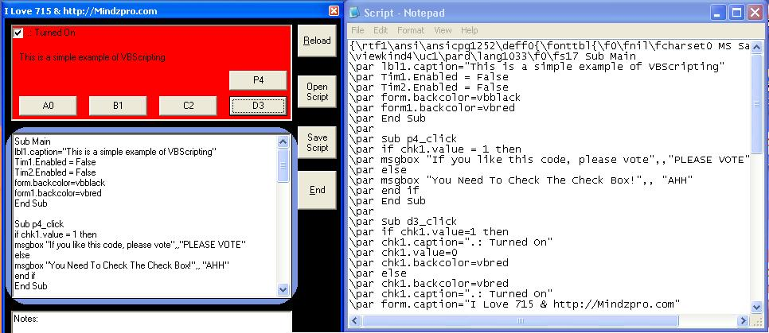



## VBScripting Made EASY\!

### Description

This code will show you how simple it is to insert VBScript into your application. This code also shows alot of features for Scripting. You can edit all of it right in the form or you can save what you have and edit in the text file. You can also open an existing vbscript text file and start editing from there. When its saved it automaticly makes it in VBScript form... See screen shot... Has a number of command buttons all doing someting differnt and putting a bunch of differnt commands at use. Practice on labels, Check boxes, Text boxes, Timers, common dialogs and more! Possiblies are endless. I hope you enjoyed my code and much i did making it. If you could please leave feedback and VOTE. :)
 
### More Info
 

             |
---                |---
**Submitted On**   |2004-12-17 23:23:36
**By**             |[Justin Lilley](https://github.com/Planet-Source-Code/PSCIndex/blob/master/ByAuthor/justin-lilley.md)
**Level**          |Beginner
**User Rating**    |4.8 (24 globes from 5 users)
**Compatibility**  |VB 5\.0, VB 6\.0
**Category**       |[Coding Standards](https://github.com/Planet-Source-Code/PSCIndex/blob/master/ByCategory/coding-standards__1-43.md)
**World**          |[Visual Basic](https://github.com/Planet-Source-Code/PSCIndex/blob/master/ByWorld/visual-basic.md)
**Archive File**   |[VBScriptin18306112182004\.zip](https://github.com/Planet-Source-Code/justin-lilley-vbscripting-made-easy__1-57781/archive/master.zip)

